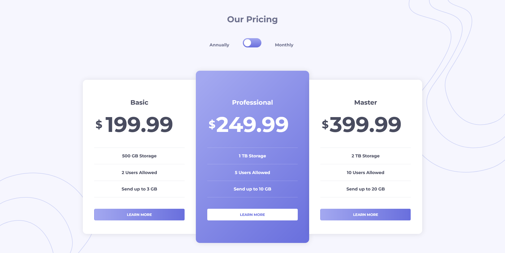

# Frontend Mentor - Pricing component with toggle solution

This is a solution to the [Pricing component with toggle challenge on Frontend Mentor](https://www.frontendmentor.io/challenges/pricing-component-with-toggle-8vPwRMIC). Frontend Mentor challenges help you improve your coding skills by building realistic projects. 

## Table of contents

- [Overview](#overview)
  - [The challenge](#the-challenge)
  - [Screenshot](#screenshot)
  - [Links](#links)
- [My process](#my-process)
  - [Built with](#built-with)
  - [What I learned](#what-i-learned)
  - [Continued development](#continued-development)
  - [Useful resources](#useful-resources)
- [Author](#author)
- [Acknowledgments](#acknowledgments)

**Note: Delete this note and update the table of contents based on what sections you keep.**

## Overview

### The challenge

Users should be able to:

- View the optimal layout for the component depending on their device's screen size
- Control the toggle with both their mouse/trackpad and their keyboard
- **Bonus**: Complete the challenge with just HTML and CSS

### Screenshot

### Links

- Solution URL: [Add solution URL here](https://www.frontendmentor.io/solutions/pricingcomponentwithtogglemaster-rkKbdJo49)
- Live Site URL: [Add live site URL here](https://pricing-component-with-toggle-master-phi.vercel.app/)

### Built with

- Semantic HTML5 markup
- CSS custom properties
- CSS Grid

### What I learned

I've learnt that there is more to learn when it comes to grid display. I struggled abit with a responsive design, had to create alot of @media properties to counter that
and i dont believe is the right practice.

### Continued development

Learning about responsive development and its implimintation - without using to much overlapping code.

### Useful resources

- [Example resource 1](https://www.youtube.com) - Youtube
- [Example resource 2](https://learncssgrid.com/) - learning grid display

## Author

- Frontend Mentor - [@XODesigns](https://www.frontendmentor.io/profile/XODesigns)
